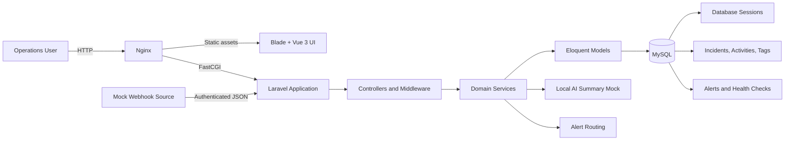

# Incident & Operations Tracking

## Table of Contents
* [Summary](#summary)
* [Features](#features)
* [Technologies](#technologies)
* [Requirements](#requirements)
* [Project Structure](#project-structure)
* [How to Run in Local Environment](#how-to-run-in-local-environment)
* [Demo Accounts](#demo-accounts)
* [Roles And Permissions](#roles-and-permissions)
* [Authentication](#authentication)
* [Key User Flows](#key-user-flows)
* [Incident Workflow](#incident-workflow)
* [Dashboard](#dashboard)
* [Alert Routing](#alert-routing)
* [Exports](#exports)
* [Mock AI Summary](#mock-ai-summary)
* [Architecture Overview](#architecture-overview)
* [Data Model Overview](#data-model-overview)
* [Local Alternatives](#local-alternatives)
* [Mock Webhook](#mock-webhook)
* [Logging](#logging)
* [Useful Commands](#useful-commands)
* [Tests](#tests)
* [Known Limitations](#known-limitations)
* [With More Time](#with-more-time)
* [AI Tools Used](#ai-tools-used)

---

## Summary

Incident & Operations Tracking is an operations intelligence module for teams that need one place to understand active incidents, ownership, urgency, SLA exposure, and response history.

It addresses fragmented operational reporting by providing a shared incident queue, dashboard metrics, role-based actions, escalation tracking, alert routing, and deterministic AI-style summaries without relying on external services.

## Features

- Operational dashboard with a daily summary plus incident, SLA, live mock uptime, tag, severity, status, and trend metrics
- Incident creation, assignment, filtering, pagination, status changes, escalation, resolution, comments, and RCA notes
- SLA health detection with breached and at-risk incident views
- Immutable activity timeline for incident changes and comments
- Role-based user management and incident permissions
- Mock alert routing based on incident creation, escalation, and SLA breach events
- Idempotent mock webhook ingestion
- CSV incident-list export and PDF incident-detail export
- Deterministic mock AI operational summary with a suggested next action
- JSON request logging with request ID, user ID, IP address, user agent, status, and duration

## Technologies

- PHP 8.5
- Laravel 13
- Vue 3
- Vite
- Tailwind CSS 4
- Nginx
- MySQL 8.4
- Docker Compose
- PHPUnit
- Playwright

## Requirements

- Docker Desktop or Docker Engine
- Docker Compose
- Available local ports:
  - `8000` for Nginx
  - `5173` for Vite development assets
  - `3306` for MySQL host access

No host installation of PHP, Composer, Node.js, or MySQL is required.

## Project Structure

```text
codes/
  app/                 Controllers, middleware, models, and services
  database/            Migrations, factories, and seeders
  resources/js/        Vue pages and components
  resources/mocks/     Mock AI response combinations
  routes/              Web and API routes

docker/
  configs/             PHP and Nginx configuration
  entrypoints/         Container startup scripts
  envs/                Service environment files and examples
  Dockerfile           PHP-FPM application image
  Nginx.Dockerfile     Nginx and production asset image
  docker-compose.yml   Base services
  docker-compose.dev.yml Development overrides
```

## How to Run in Local Environment

Clone the public repository and enter the Docker project:

```bash
git clone https://github.com/shakibmostahid/operations-intelligence-module.git
cd operations-intelligence-module/docker
```

Create the local environment files before build:

```bash
cp .env.example .env
cp envs/app.env.example envs/app.env
cp envs/mysql.env.example envs/mysql.env
```

Build the docker images

```bash
docker compose build app
```

Generate an application key:

```bash
docker compose run --rm app php artisan key:generate --show
```

Place the generated key in `envs/app.env`:

```env
APP_KEY=base64:generated-value
```

Initialize the database with pre seed data:

```bash
docker compose run --rm app php artisan migrate --seed
```

Start the application:

```bash
docker compose up -d app
```

The `app` service depends on healthy Nginx and MySQL services, so this command starts the complete stack.

Open the application at:

```text
http://localhost:8000
```

## Demo Accounts

| Role | Email | Password | Behavior |
| --- | --- | --- | --- |
| Super Admin | `super.admin@iot.com` | `incident@admin` | Ready to use |
| Admin | `admin@iot.com` | `password` | Must change password |
| Support Engineer | `support@iot.com` | `password` | Must change password |
| Viewer | `viewer@iot.com` | `password` | Must change password |

## Roles And Permissions

- `super_admin`: manages users and can change any active incident status.
- `admin`: creates lower-role users and manages lower-role accounts.
- `support_engineer`: works on incidents and comments.
- `viewer`: read-only access to operational data.

Incident status can be changed only by the incident creator, assigned user, or super admin. Assignment is fixed after creation. Escalation requires a reason. Resolved incidents are locked, while non-viewers may continue adding comments.

## Authentication

- Laravel web authentication uses database-backed sessions.
- Only active accounts may sign in.
- After creating an user temporary password will be set. Upon login, temporary-password users are redirected to the password-change page.
- A new password cannot match the current password.
- Successful login regenerates the session ID.
- Deactivating a user removes their active database sessions.
- Session lifetime is 120 minutes of inactivity.

## Key User Flows

1. Sign in with a seeded account. Users with temporary passwords must choose a new password before continuing.
2. Review dashboard metrics, trends, system uptime, assigned work, routed alerts, and unresolved SLA breaches.
3. Create an incident with severity, tags, assignment, description, and an optional SLA deadline.
4. Search and filter the incident list by status, severity, assignee, tag, SLA state, and creation date.
5. Open an incident to review its details, duration, SLA state, activity timeline, and generated operational summary.
6. Authorized users can comment, move status forward or backward, escalate with a reason, add RCA notes, and resolve the incident.
7. Administrators can create users and activate or deactivate accounts within their role permissions.
8. Export the filtered incident list as CSV or an individual incident as PDF.

## Incident Workflow

Incidents begin with `open` status and support:

```text
open
investigating
escalated
resolved
```

Status changes may move forward or backward before resolution. Escalations create timeline activity and trigger matching alert rules. Resolution records the completion time and locks incident details.

The incident list supports search and filtering by severity, status, assigned user, tag, SLA state, and creation date. It also supports ID sorting, selectable page sizes, CSV export, and direct navigation to incident details.

## Dashboard

The dashboard includes:

- Total, critical, and escalated incident metrics
- Severity or status distribution chart
- Incident counts by tag
- Created-versus-resolved trend chart
- Simulated service uptime metrics
- Current user’s unresolved assigned incidents
- Paginated unresolved SLA breaches
- Routed in-app alerts
- Deterministic daily operations summary
- Live mock system probes refreshed without a page reload
- Live System health data based on mock data.

Dashboard metrics support predefined and custom date ranges.

## Alert Routing

Seeded alert rules create in-app alerts for:

- Critical incident creation
- Incident escalation
- SLA breach

Recipients are selected from configured roles and the incident’s assigned user.

## Exports

- Incident lists can be exported as CSV with current filters applied.
- Individual incidents can be exported as PDF with details and timeline data.

## Mock AI Summary

Incident details request an operational summary from:

```text
GET /incidents/{incident}/operational-summary
```

The authenticated endpoint combines severity, status, SLA state, assignment, tags, and timeline activity. The page displays a generating animation before rendering the summary and suggested next action.

Responses are deterministic and loaded from:

```text
codes/resources/mocks/ai-operational-summary.json
```

## Architecture Overview

The application uses a conventional server-rendered Laravel structure with Vue pages mounted into a shared Blade entry point.



- **Nginx** receives browser requests, serves public assets, and forwards PHP requests to PHP-FPM.
- **Laravel controllers** validate HTTP input and delegate operational behavior to service classes.
- **Service classes** contain incident, dashboard, user, profile, alert-routing, system-health, and mock-summary business logic.
- **Eloquent models** define the relational domain and persistence behavior.
- **Vue 3 pages** provide the dashboard and form interactions while Laravel remains responsible for routing, authentication, validation, and authorization.
- **MySQL** stores users, incidents, timelines, alerts, system checks, and database-backed sessions.
- **Docker Compose** runs PHP-FPM, Nginx, MySQL, and the optional Playwright test container.

## Data Model Overview

| Model | Purpose | Main relationships |
| --- | --- | --- |
| `Role` | Defines `super_admin`, `admin`, `support_engineer`, and `viewer` access levels | Has many users |
| `User` | Authenticated operator with status and temporary-password state | Belongs to role; creates users/incidents; receives assignments and alerts |
| `Incident` | Core operational record with severity, status, SLA deadline, resolution, source, and RCA | Belongs to creator and assignee; has activities and tags |
| `IncidentActivity` | Timeline entry for creation, comments, status changes, assignment, escalation, and resolution | Belongs to incident and optional user |
| `Tag` | Categorizes incidents for grouping and reporting | Many-to-many with incidents through `incident_tag` |
| `AlertRule` | Configures local routing by event, severity, and recipient roles | Evaluated when operational events occur |
| `Alert` | Database-backed routed notification | Belongs to incident, rule, and recipient user |

Laravel also uses `sessions` for database-backed sessions.

## Local Alternatives

The local project does not depend on any external API:

- AI summaries use the local mock API and JSON response combinations.
- Webhook ingestion is exposed as a local authenticated endpoint.
- Alert routing creates local database-backed alerts.

These mocks and local alternatives allow the complete workflow to run without third-party accounts, credentials, or network services.

## Mock Webhook

Configure `INCIDENT_WEBHOOK_TOKEN` in `docker/envs/app.env`, then submit an incident:

```bash
curl -X POST http://localhost:8000/api/webhooks/incidents \
  -H 'Content-Type: application/json' \
  -H 'X-Webhook-Token: your-configured-token' \
  -d '{
    "external_id": "MON-1042",
    "source": "monitoring",
    "title": "Checkout API unavailable",
    "description": "Health checks failed five times.",
    "severity": "critical",
    "sla_deadline": "2026-06-11 12:00:00"
  }'
```

The combination of `source` and `external_id` makes webhook delivery idempotent.

## Logging

Application logs are written to the container console by default. HTTP request logs use JSON and include:

- Request ID
- Method, route, path, and response status
- Authenticated user ID
- IP address and user agent
- Request and response sizes
- Execution duration

Log Sample:

```json
{"message":"HTTP request completed","context":{"event":"http.request","request_id":"af92bc94-0d49-4b34-9894-30955cc0052d","method":"GET","path":"/dashboard","route":"dashboard","action":"App\\Http\\Controllers\\DashboardController","status":200,"duration_ms":201.72,"user_id":1,"ip_address":"ip","user_agent":"Mozilla/5.0 (Macintosh; Intel Mac OS X 10_15_7) AppleWebKit/537.36 (KHTML, like Gecko) Chrome/149.0.0.0 Safari/537.36","referer":"localhost/incidents/9","content_type":null,"request_bytes":null,"response_bytes":null,"query_keys":[]},"level":200,"level_name":"INFO","channel":"production","datetime":"2026-06-13T00:33:47.132942+06:00","extra":{}}
```

View live application and request logs with:

```bash
cd docker
docker compose logs -f app
```

## Useful Commands

```bash
# Run migrations
docker compose exec app php artisan migrate

# Rebuild demo data
docker compose exec app php artisan migrate:fresh --seed

# Clear Laravel caches
docker compose exec app php artisan optimize:clear

# Run tests
docker compose exec app ./vendor/bin/phpunit

# Build frontend assets
docker compose exec app npm run build
```

## Run Tests

Run the PHPUnit unit and feature suite:

```bash
cd docker
docker compose exec app ./vendor/bin/phpunit
```

The backend suite covers authentication behavior, incident status authorization, backward status changes, escalation reason validation, resolved-incident locking, and mock AI summary generation.

Run the Playwright browser smoke tests against the Docker application:

```bash
cd docker
docker compose -f docker-compose.e2e.yml up --abort-on-container-exit --exit-code-from playwright playwright
```

The E2E Compose file includes the base and development Compose files automatically. The Playwright suite verifies protected-route redirects, seeded super-admin login, dashboard access, incident navigation, and asynchronous AI summary generation. The first run downloads the official Playwright Docker image.

## Known Limitations

- Alerts are stored and displayed in the application; there is no email, SMS, Slack, or push delivery.
- AI summaries are deterministic mock responses rather than output from a language model.
- System uptime data is seeded simulation data, not live monitoring telemetry.
- Webhook authentication uses one shared token and does not include signatures, replay protection, or source-specific credentials.
- Incident assignment is intentionally fixed after creation.
- The application has no background queue, scheduler worker, Redis, or real-time updates.
- Role permissions are implemented for the demonstrated workflows rather than through a complete policy/permission management system.
- PHPUnit and Playwright cover critical paths, but the project does not attempt exhaustive browser or authorization coverage.

## Time Constrained Feature Backlog 

1. Add comment tagging and mentions to connect timeline discussions with users, teams, and incident context.
2. Send activity notifications to relevant users by email.
3. Expand health checks with detailed history and asynchronous collection.
4. Move SLA-breach detection to a scheduled asynchronous process.
5. Process alert routing and delivery asynchronously with retry and failure tracking.
6. Replace the deterministic mock with a production-ready AI operational summary provider.
7. Generate reports from API request logs and automatically create incidents when configurable failure thresholds are exceeded.
8. Add a CI/CD pipeline for automated testing, frontend builds, image validation, and deployment.
9. Add a secure password-reset workflow with expiring tokens and email delivery.

## AI Tools Used

OpenAI Codex was used as an implementation assistant for code generation, debugging, test creation, Docker configuration, and documentation drafting.

AI-generated output was not accepted without review. Changes were checked against the existing architecture, inspected through diffs, syntax-checked, compiled with the production Vite build, and exercised through PHPUnit and Playwright. The runtime AI-style incident summary remains a deterministic local mock and does not call Codex or any external AI service.
